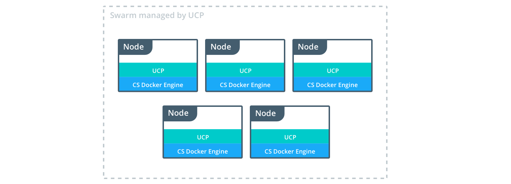

<!--[metadata]>
+++
title = "Architecture"
description = "Learn about the architecture of Docker Trusted Registry."
keywords = ["docker, registry, dtr, architecture"]
[menu.main]
parent="workw_dtr"
identifier="dtr_architecture"
weight=20
+++
<![end-metadata]-->

# DTR architecture

Docker Trusted Registry (DTR) is a Dockerized application that on a Docker
Universal Control Plane cluster.

## Containers

When you install DTR on a node, the following containers are started:

| Name                             | Description                                                                                                                       |
|:---------------------------------|:----------------------------------------------------------------------------------------------------------------------------------|
| dtr-nginx-&lt;replica_id&gt;     | Receives http and https requests and proxies them to other DTR components. By default it listens to ports 80 and 443 of the host. |
| dtr-api-&lt;replica_id&gt;       | Executes the DTR business logic. It serves the DTR web application, and API.                                                      |
| dtr-registry-&lt;replica_id&gt;  | Implements the functionality for pulling and pushing Docker images. It also handles how images are stored.                        |
| dtr-etcd-&lt;replica_id&gt;      | A key-value store for persisting DTR configuration settings. Don't use it in your applications, since it's for internal use only. |
| dtr-rethinkdb-&lt;replica_id&gt; | A database for persisting repository metadata. Don't use it in your applications, since it's for internal use only.               |

## Networks

To allow containers to communicate, when installing DTR the following networks
are created:

| Name   | Type    | Description                                                                                                                                                                           |
|:-------|:--------|:--------------------------------------------------------------------------------------------------------------------------------------------------------------------------------------|
| dtr-br | bridge  | Allows containers on the same node to communicate with each other in a secure way.                                                                                                    |
| dtr-ol | overlay | Allows containers running on different nodes to communicate. This network is used in high-availability installations, to allow Etcd and RethinkDB containers to replicate their data. |

The communication between all DTR components is secured using TLS. Also, when
installing DTR, two Certificate Authorities (CAs) are created. These CAs are
used to create the certificates used by Etcd and RethinkDB when communicating
across nodes.

## Volumes

DTR uses these named volumes for persisting data:

| Volume name                     | Location on host (/var/lib/docker/volumes/) | Description                                                                                                  |
|:--------------------------------|:--------------------------------------------|:-------------------------------------------------------------------------------------------------------------|
| dtr-ca-&lt;replica_id&gt;       | dtr-ca/_data                                | The volume where the private keys and certificates are stored so that containers can use TLS to communicate. |
| dtr-etcd-&lt;replica_id&gt;     | dtr-etcd/_data                              | The volume used by etcd to persist DTR configurations.                                                       |
| dtr-registry-&lt;replica_id&gt; | dtr-registry/_data                          | The volume where images are stored, if DTR is configured to store images on the local filesystem.            |
| dtr-rethink-&lt;replica_id&gt;  | dtr-rethink/_data                           | The volume used by RethinkDB to persist DTR data, like users and repositories.                               |

If you don’t create these volumes, when installing DTR they are created with
the default volume driver and flags.

## Image storage

By default, Docker Trusted Registry stores images on the filesystem of the host
where it is running.

You can also configure DTR to using these cloud storage backends:

* Amazon S3
* OpenStack Swift
* Microsoft Azure

For highly available installations, configure DTR to use a cloud storage
backend or a network filesystem like NFS.

## High-availability support

For load balancing and high-availability, you can install multiple replicas of
DTR, and join them to create a cluster.
[Learn more about high availability](high-availability/high-availability.md).

## Where to go next

* [System requirements](install/system-requirements.md)
* [Install DTR](install/install-dtr.md)
