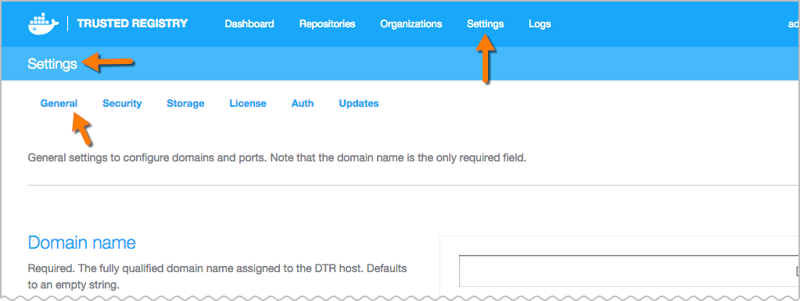

+++
title = "Configure general settings"
description = "Configure general settings for Docker Trusted Registry"
keywords = ["docker, documentation, about, technology, understanding, enterprise, hub, general, domain name, HTTP, HTTPS ports, Notary, registry"]
[menu.main]
parent="workw_dtr_configure"
identifier="dtr_configure_general"
weight=3
+++

# Configure general settings

This document describes the general settings you need to configure including using Trusted Content through setting up your Notary server.

## Configure your domain name and port settings

Each setting on this page is explained in the Docker Trusted Registry UI.

* *Domain Name*: **required**. By default it is an empty string. It is the fully qualified domain name assigned to the Docker Trusted Registry host.
* *HTTP Port*: defaults to 80 and is used as the entry point for the image storage service. To see load balancer status, you can query
http://&lt;dtr-host&gt;/load_balancer_status.
* *HTTPS Port*: defaults to 443, used as the secure entry point for the image storage service.
* *HTTP proxy*: defaults to an empty string, proxy server for HTTP requests.
* *HTTPS proxy*: defaults to an empty string, proxy server for HTTPS requests.
* *No proxy*: defaults to an empty string, proxy bypass for HTTP and HTTPS requests.
* *Upgrade checking*: enables or disables automatic checking for the Trusted Registry software updates.

If you need the Trusted Registry to re-generate a self-signed certificate at
some point, you can change the domain name. Whenever the domain name does not
match the current certificate, a new self-signed certificate is generated
for the new domain. This also works with IP addresses.

## Configure Notary

> **Note**: The Trusted Registry's integration of Docker Notary is an experimental feature. The use of a Notary server with Trusted Registry is not officially supported.

To use Docker Notary, first deploy your own Notary server and then integrate
with your Trusted Registry through the Settings page. Then, you'll need to
configure your Docker clients to use trust. The Trusted Registry proxies
requests to Notary, so you don't need to explicitly trust Notary's certificate
from the docker client.

Once you enable Notary integration and configure your Docker clients, your
organization can push and pull trusted images. After pushing images in this
configuration to the Trusted Registry, you can see which image tags were signed
by viewing the appropriate repositories through Trusted Registry's web
interface.

To deploy a Notary server follow the instructions at [Deploying
Notary](/engine/security/trust/deploying_notary.md). You can deploy a Notary
server on the same machine as the Trusted Registry. If you do this, you can
connect to the Notary server directly using the IP address of the `docker0`
interface. The interface's address is typically `172.17.42.1`. Read more about
[Docker Networking](https://docs.docker.com/engine/userguide/networking/index.md) to learn about the
`docker0` interface. You can also connect using the machine's external IP
address and port combination provided you expose the proper port.  

Once you've deployed your Notary server, do the following:

1. Return to the Trusted Registry in your browser and configure the following
options:

  * *Notary Server*: This is the domain name or IP address where you deployed the Notary server.   

  * *Notary Verify TLS*: This is off by default and you should verify that your connection to Notary works with this turned off before trying to enable it. If Notary's certificate is signed by a public Certificate Authority, you can turn this on and it should work given that the domain name (or IP) matches the one in the certificate.

  * *Notary TLS Root CA*: If you don't use a publicly signed certificate but still want to have a secure connection between
  the Trusted Registry and Notary, then put the root Certificate Authority's certificate in this field. You can also use a self signed certificate at this location.

2. Once you've configured the Notary settings, save them. After you save, the
Trusted Registry tries to connect to Notary to confirm that the address is
correct. It configures itself as a reverse proxy to the Notary server to make it
easier for clients to automatically use the correct Notary server.

3. Configure your Docker client to use content trust operations.

    To configure your Docker client to be able to push signed images to Docker
    Trusted Registry refer to the CLI Reference's [Environment Variables
    Section](https://docs.docker.com/engine/reference/commandline/cli.md#environment-variables) and
    [Notary Section](https://docs.docker.com/engine/reference/commandline/cli.md#Notary).

    This requires you to set the `DOCKER_CONTENT_TRUST` variable and configure
    your system to trust Docker Trusted Registry's TLS certificate if it doesn't
    already.

4. Use a client to push an image with trust.

5. Verify the image is signed by visiting the image repository's page through
the Trusted Registry interface.

## See also

* [Configure authentication](config-auth.md)
* [Configure storage settings](config-storage.md)
