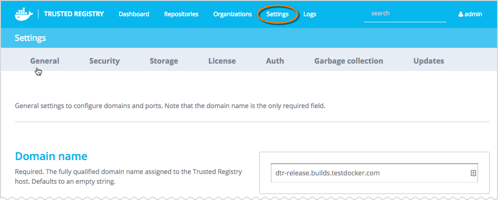

+++
title = "Configuration overview"
description = "Configuration overview for Docker Trusted Registry"
keywords = ["docker, documentation, about, technology, understanding, enterprise, hub,  registry"]
[menu.main]
parent="workw_dtr_configure"
weight=2
+++

# Configure overview

When you first install Docker Trusted Registry, you need to configure it. Use
this overview to see what you can configure.

To start, navigate to the Trusted Registry user interface (UI) > Settings, to
view configuration options. Configuring is grouped by the following:

* [General settings](config-general.md) (ports, proxies, and Notary)
* [Security settings](config-security.md)
* [Storage settings](config-storage.md)
* [License](../license.md)
* [Authentication settings](config-auth.md) (including LDAP)
* [Garbage collection](../soft-garbage.md)
* Updates
* Docker daemon (this is set from the Trusted Registry CLI and not the UI)

Saving changes you've made to settings will restart various services, as follows:

 * General settings: full Docker Trusted Registry restart
 * License change: full Docker Trusted Registry restart
 * SSL change: Nginx reload
 * Storage config: only registries restart
 * Authentication config: no restart

However, your first configuration task is to create a system administrator account.

## Get started by creating your admin account

When you have finished installing Docker Trusted Registry for the first time, you are unable to do anything until you create a system administrator account. Create it using the authentication method (either Managed or LDAP) that you intend to use in order to manage the Trusted Registry.

### Create an admin using managed mode

1. Navigate to the Trusted Registry dashboard > Settings > Auth.
2. Select Managed from the Authentication Method drop-down form.
3. Fill out the forms for Username, Password, and ensure to select under Global role, Admin - all repositories.
4. Save your work.

### Create an admin using LDAP mode

If you create an admin using the LDAP mode, then you will need to create a filter and then sync your data.

1. Navigate to the Trusted Registry dashboard > Settings > Auth.
2. Select LDAP from the Authentication Method drop-down form.
3. Enter a new Admin Password. This password is also the admin recovery password.
4. At a minimum, enter your information in the following fields and save.

    * LDAP Server URL
    * Use StartTLS (you can leave this unchecked)
    * User Base DN
    * User Login Attribute
    * Search User DN
    * Search User Password
    * LDAP Sync Interval

## Docker daemon logs

Both the Trusted Registry and the Docker daemon collect and store log messages. To limit duplication of the Docker daemon logs, add the following parameters in a Trusted Registry CLI to the Docker daemon and then restart the daemon.

`docker daemon --log-opt max-size 100m max-file=1`

To learn about Trusted Registry logs, view the [Logs tab](../adminguide.md) in the admin guide documentation.

## See also

* To use Docker Trusted Registry, see the [User guide](../userguide.md).
* View [admin tasks](../adminguide.md).
* To upgrade, see the [Upgrade guide](../install/upgrade.md).
* To see previous changes and fixes, refer to the [release notes](../release-notes.md).
* For information on getting support for Docker Trusted Registry, go to [Support information](../support.md).
