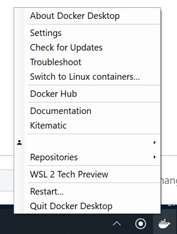
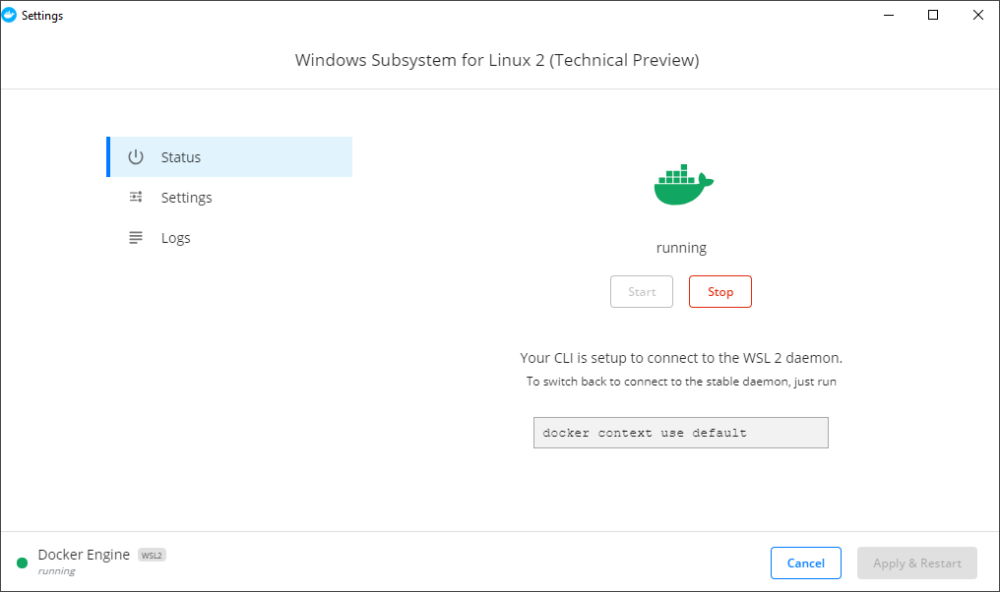

# Overview

Welcome to Docker Desktop WSL 2 Tech Preview. This Tech Preview introduces support to run Docker Desktop with WSL 2. We really appreciate you trialing this Tech Preview. Your feedback is very important to us. Please let us know your feedback by creating an issue in the [Docker Desktop for Windows GitHub](https://github.com/docker/for-win/issues) repository and adding the **WSL 2** label.

WSL 2 introduces a significant architectural change as it is a full Linux kernel built by Microsoft, allowing Linux containers to run natively without emulation. With Docker Desktop WSL 2 Tech Preview, users can access Linux workspaces without having to maintain both Linux and Windows build scripts.

Docker Desktop also leverages the dynamic memory allocation feature in WSL 2 to greatly improve the resource consumption. This means, Docker Desktop only uses the required amount of CPU and memory resources, enabling CPU and memory-intensive tasks such as building a container to run much faster.

Additionally, with WSL 2, the time required to start a Docker daemon after a cold start is significantly faster. It takes less than 2 seconds to start the Docker daemon when compared to tens of seconds in the current version of Docker Desktop.

> Note that it is currently not possible to run Kubernetes while running Docker Desktop on WSL 2. However, you can continue to use Kubernetes in the non-WSL 2 Docker Desktop using the Daemon **Settings** option.

# Prerequisites

Before you install Docker Desktop WSL 2 Tech Preview, you must complete the following steps:

1. Install Windows 10 Insider Preview build 18932 or later.
2. Enable WSL 2 feature on Windows. For detailed instructions, refer to the [Microsoft documentation](https://docs.microsoft.com/en-us/windows/wsl/wsl2-install).
3. Install a default distribution based on Ubuntu 18.04. You can check this with `wsl lsb_release -a`. You can download Ubuntu 18.04 from the [Microsoft store](https://www.microsoft.com/en-us/p/ubuntu-1804-lts/9n9tngvndl3q).
4. Ensure the Ubuntu distribution runs in WSL 2 mode. WSL can run distributions in both v1 or v2 mode.

    To check the WSL mode, run:

    `wsl -l -v`

    To upgrade to v2, run:

    `wsl --set-version <distro name> 2`

# Download

To download the Tech Preview, click [Docker Desktop WSL 2 Tech Preview Installer](https://download.docker.com/win/edge/36883/Docker%20Desktop%20Installer.exe).

# Installation

Ensure you have completed the steps described in the Prerequisites section **before** installing the Tech Preview.

Follow the usual Docker Desktop installation instructions to install the Tech Preview. After a successfully installation, the Docker Desktop menu displays the **WSL 2 Tech Preview** option.

Select **WSL 2 Tech Preview** from the menu to start, stop, and configure the daemon running in WSL 2. When the WSL 2 daemon starts, a docker CLI context is automatically created for it, and the CLI configuration points to the context. You can list contexts by running `docker context ls`.

Docker Desktop allows you to toggle between the WSL modes. To use the classic daemon, run `docker context use default`. To switch to WSL 2, run `docker context use wsl`.
