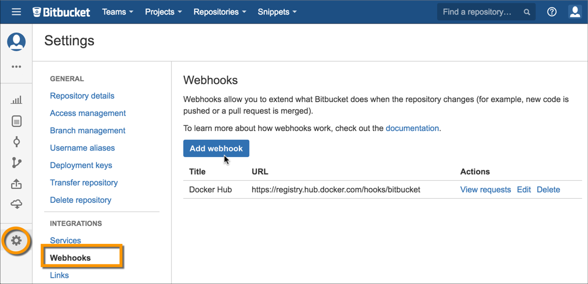

If you have previously linked Docker Hub to your Bitbucket account, skip to
[Build Docker images automatically](index).

## Link to a Bitbucket user account

1.  Log in to Docker Hub with your Docker ID.

2.  In Docker Hub, select **Settings** > **Source providers**.

3.  Scroll to the **Source providers** section.

4.  Click the plug icon for the source provider you want to link.

5.  If necessary, log in to Bitbucket.

6.  On the page that appears, click **Grant access**.

### Unlink a Bitbucket user account

To revoke Docker Hub access to your Bitbucket account, unlink it both from Docker
Hub _and_ from your GitHub account.

1.  Log in to Docker Hub with your Docker ID.

2.  In Docker Hub, select **Settings** > **Source providers**.

3.  Click the plug icon next to the source provider you want to remove.

    The icon turns gray and has a slash through it when the account is disabled,
    however access may not have been revoked. You can use this to _temporarily_
    disable a linked source code provider account.

4.  Go to your Bitbucket account and click the user menu icon in the top right corner.

5.  Click **Bitbucket settings**.

6.  On the page that appears, click **OAuth**.

7.  Click **Revoke** next to the Docker Hub line.

> Webhooks not automatically removed
>
> Each repository that is configured as an automated build source contains a
> webhook that notifies Docker Hub of changes in the repository. This webhook is
> not automatically removed when you revoke access to a source code provider.

## Create an automated build

You can [create an Automated Build](https://hub.docker.com/add/automated-build/bitbucket/){: target="_blank" class="_"}
from any of your public or private Bitbucket repositories with a `Dockerfile`.

To get started, log in to Docker Hub and click the "Create &#x25BC;" menu item
at the top right of the screen. Then select
[Create Automated Build](https://hub.docker.com/add/automated-build/bitbucket/){: target="_blank" class="_"}.

Select the linked Bitbucket account, and then choose a repository to set up
an Automated Build for.

## The Bitbucket webhook

When you create an Automated Build in Docker Hub, a webhook is added to your
Bitbucket repository automatically.

You can also manually add a webhook from your repository's **Settings** page.
Set the URL to `https://registry.hub.docker.com/hooks/bitbucket`, to be
triggered for repository pushes.

