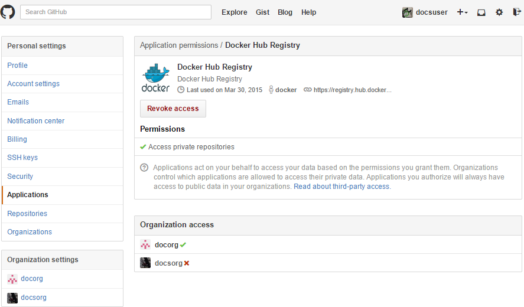
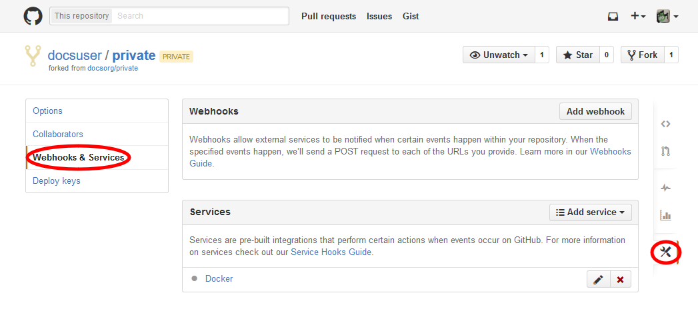

If you have previously linked Docker Hub to your GitHub account, skip to
[Build Docker images automatically](index).

## Link to a GitHub user account

1.  Log in to Docker Hub with your Docker ID.

2.  In Docker Hub, select **Settings** > **Source providers**.

3. Click the plug icon for the source provider you want to link.

4. Review the settings for the **Docker Hub Builder** OAuth application.

    > GitHub organization owners
    >
    > If you are the owner of a Github organization, you might see options to
    grant Docker Hub access to them from this screen. You can also individually
    edit third-party access settings to grant or revoke Docker Hub access. See
    [Grant access to a GitHub organization](link-source.md#grant-access-to-a-github-organization).

5. Click **Authorize application** to save the link.

You are now ready to create a new image!

### Unlink a GitHub user account

To revoke Docker Hub access to your GitHub account, unlink it both from Docker
Hub _and_ from your GitHub account.

1.  Log in to Docker Hub with your Docker ID.

2.  In Docker Hub, select **Settings** > **Source providers**.

3.  Click the plug icon next to the source provider you want to remove.

    The icon turns gray and has a slash through it when the account is disabled
    but not revoked. You can use this to _temporarily_ disable a linked source
    code provider account.

4.  Go to your GitHub account **Settings** page.

5.  Click **OAuth applications**.

6.  Click **Revoke** next to the Docker Hub Builder application.

> Webhooks not automatically removed
>
> Each repository that is configured as an automated build source contains a
> webhook that notifies Docker Hub of changes in the repository. This webhook is
> not automatically removed when you revoke access to a source code provider.

## Grant or revoke access to a GitHub organization

If you are the owner of a Github organization you can grant or revoke Docker Hub
access to the organization's repositories. Depending on the GitHub organization
settings, you may need to be an organization owner.

If the organization has not had specific access granted or revoked before, you
can often grant access at the same time as you link your user account. In this
case, a **Grant access** button appears next to the organization name in the
link accounts screen, as shown below. If this button does not appear, you must
manually grant the application's access.

To manually grant or revoke Docker Hub access to a GitHub organization:

1.  [Link to your GitHub user account](#link-to-a-github-user-account).

2.  From your GitHub account settings, locate the **Organization settings**
    section at the lower left.

3.  Click the organization to which you want to give Docker Hub access.

4.  From the Organization Profile menu, click **Third-party access**.

5.  Click the pencil icon next to Docker Hub Builder.

6.  Click **Grant access** next to the organization.

    To revoke access,  click **Deny access**.

## Auto builds and limited linked GitHub accounts.

If you selected to link your GitHub account with only a "Limited Access" link,
then after creating your automated build, you need to either manually trigger a
Docker Hub build using the "Start a Build" button, or add the GitHub webhook
manually, as described in [GitHub Service Hooks](#github-service-hooks). This
only works for repositories under the user account, and adding an automated
build to a public GitHub organization using a "Limited Access" link is not
possible.

## Change the GitHub user link

If you want to remove, or change the level of linking between your GitHub
account and the Docker Hub, you need to do this in two places:

- Remove the "Linked Account" from your Docker Hub "Settings".

- Go to your GitHub account's Personal settings, and in the "Applications" section, "Revoke access".

You can now re-link your account at any time.

> Deleting GitHub account linkage
>
> If you delete the GitHub account linkage to an automated build repo, the
> previously built images are still available. If you later re-link to that
> GitHub account, the automated build can be started with the "Start Build"
> button; or if the webhook on the GitHub repository still exists, it is
> triggered by any subsequent commits.

## GitHub organizations

GitHub organizations and private repositories forked from organizations are
made available to auto build using the "Docker Hub Registry" application, which
needs to be added to the organization - and then applies to all users.

To check, or request access, go to your GitHub user's "Setting" page, select the
"Applications" section from the left side bar, then click the "View" button for
"Docker Hub Registry".

The organization's administrators may need to go to the Organization's "Third
party access" screen in "Settings" to grant or deny access to the Docker Hub
Registry application. This change applies to all organization members.

More detailed access controls to specific users and GitHub repositories can be
managed using the GitHub "People and Teams" interfaces.

## Create an automated build with GitHub

You can [create an Automated Build](https://hub.docker.com/add/automated-build/github/){: target="_blank" class="_"}
from any of your public or private GitHub repositories that have a `Dockerfile`.

Once you've selected the source repository, you can then configure:

- Hub user/org namespace the repository is built to (with Docker ID or Hub organization name)
- Docker repository name the image is built to.
- Description of the repository.
- Accessibility: If you add a Private repository to a Hub user namespace, then
  you can only add other users as collaborators, and those users can view and
  pull all images in that repository. To configure more granular access
  permissions, such as using teams of users or allow different users access to
  different image tags, then you need to add the Private repository to a Hub
  organization for which your user has Administrator privileges.
- Enable or disable rebuilding the Docker image when a commit is pushed to the
  GitHub repository.

You can also select one or more:

- Git branch/tag.
- Repository sub-directory to use as the context.
- Docker image tag name.

You can modify the description for the repository by clicking the "Description"
section of the repository view. The "Full Description" is over-written by the
README.md file when the next build is triggered.

## GitHub private submodules

If your GitHub repository contains links to private submodules, your build fails.

Normally, the Docker Hub sets up a deploy key in your GitHub repository.
Unfortunately, GitHub only allows a repository deploy key to access a single
repository.

To work around this, you can create a dedicated user account in GitHub and
attach the automated build's deploy key that account. This dedicated build
account can be limited to read-only access to just the repositories required to
build.

<table class="table table-bordered">
  <thead>
    <tr>
      <th>Step</th>
      <th>Screenshot</th>
      <th>Description</th>
    </tr>
  </thead>
  <tbody>
    <tr>
      <td>1.</td>
      <td></td>
      <td>First, create the new account in GitHub. It should be given read-only
      access to the main repository and all submodules that are needed.</td>
    </tr>
    <tr>
      <td>2.</td>
      <td></td>
      <td>This can be accomplished by adding the account to a read-only team in
      the organization(s) where the main GitHub repository and all submodule
      repositories are kept.</td>
    </tr>
    <tr>
      <td>3.</td>
      <td></td>
      <td>Next, remove the deploy key from the main GitHub repository. This can be done in the GitHub repository's "Deploy keys" Settings section.</td>
    </tr>
    <tr>
      <td>4.</td>
      <td></td>
      <td>Your automated build's deploy key is in the "Build Details" menu
      under "Deploy keys".</td>
    </tr>
    <tr>
      <td>5.</td>
      <td></td>
      <td>In your dedicated GitHub User account, add the deploy key from your
      Docker Hub Automated Build.</td>
    </tr>
  </tbody>
</table>

## GitHub service hooks

A GitHub Service hook allows GitHub to notify the Docker Hub when something has
been committed to a given git repository.

When you create an Automated Build from a GitHub user that has full "Public and
Private" linking, a Service Hook should get automatically added to your GitHub
repository.

If your GitHub account link to the Docker Hub is "Limited Access", then you
need to add the Service Hook manually.

To add, confirm, or modify the service hook, log in to GitHub, then navigate to
the repository, click "Settings" (the gear), then select "Webhooks & Services".
You must have Administrator privileges on the repository to view or modify
this setting.

The image below shows the "Docker" Service Hook.

If you add the "Docker" service manually, make sure the "Active" checkbox is
selected and click the "Update service" button to save your changes.
