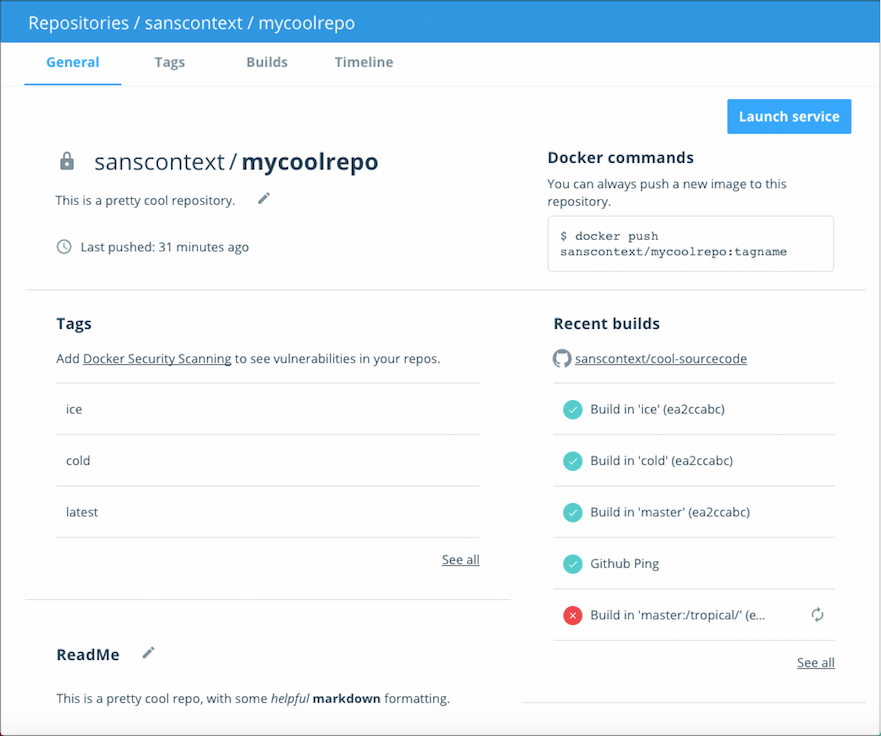

Docker Hub provides a hosted registry service where you can create
repositories to store your Docker images. You can choose to push images to the
repositories directly, or link to your source code and build them in Docker
Hub.

You can build images manually, or set up automated builds to rebuild your Docker
image on each `git push` to the source code. You can also create automated
tests, and when the tests pass use autoredeploy to automatically update your
running services when a build passes its tests.

* [Repositories in Docker Hub](repos.md)
* [Link to a source code repository](link-source.md)
* [Automated builds](automated-build.md)
* [Automated repository tests](automated-testing.md)
* [Advanced options for Autobuild and Autotest](advanced.md)

{:width="650px"}
