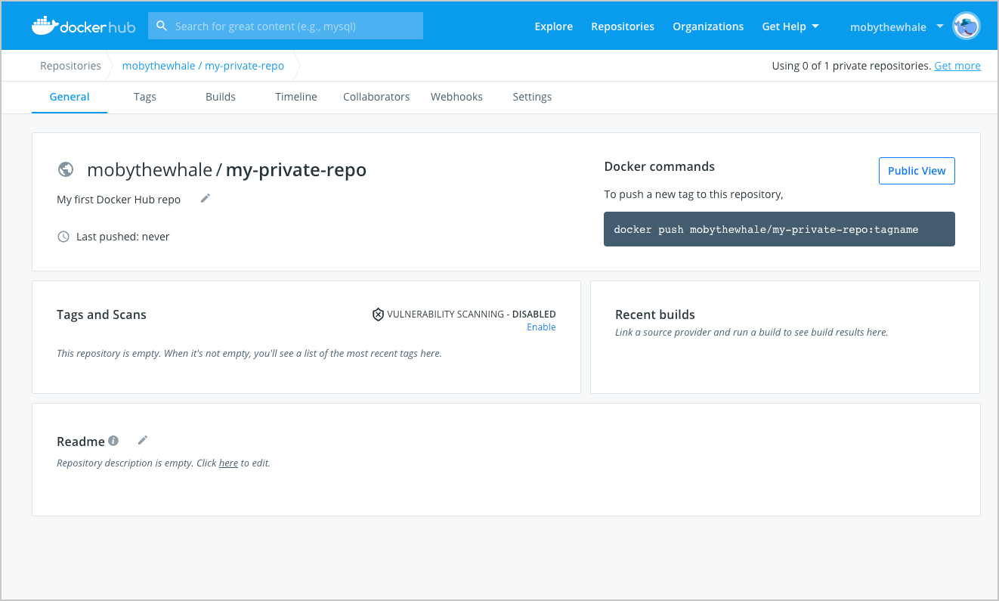
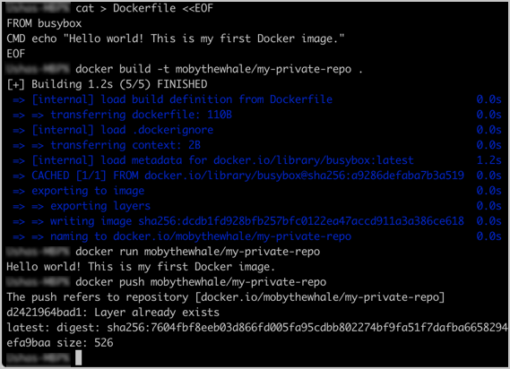

[Docker Hub](https://hub.docker.com) is a service provided by Docker for finding and sharing container images with your team. It provides the following major features:
* [Repositories](/docker-hub/repos.md): Push and pull container images.
* [Teams & Organizations](/docker-hub/orgs.md): Manage access to private repositories of container images.
* [Official Images](/docker-hub/official_images.md): Pull & use high-quality container images provided by Docker.
* [Publisher Images](/docker-hub/publish/customer_faq.md): Pull & use high-quality container
  images provided by external vendors. Certified images also include support and guarantee
  compatibility with Docker Enterprise.
* [Builds](/docker-hub/builds.md): Automatically build container images from GitHub and Bitbucket and push them to Docker Hub
* [Webhooks](/docker-hub/webhooks.md): Trigger actions after a successful push
  to a repository to integrate Docker Hub with other services.


### Step 1: Sign up for Docker Hub

Start by [creating an account](https://hub.docker.com/signup).

### Step 2: Create your first repository

To create a repo:
1. Sign in to [Docker Hub](https://hub.docker.com)
2. Click on Create Repository on the Docker Hub welcome page: 
3. Name it **<your_username>/my-first-repo** as shown below. Select **Private**:


You've created your first repo. You should see:



### Step 3: Download and install Docker Desktop

We'll need to download Docker Desktop to build and push a container image to Docker Hub.

1. Download and install [Docker Desktop](https://docker.com/get-started). If on Linux, download [Docker Engine - Community](https://hub.docker.com/search?type=edition&offering=community)
2. Open the terminal and sign in to Docker Hub on your computer by running `docker login`

### Step 4: Build and push a container image to Docker Hub from your computer

Start by creating a Dockerfile to specify your application as shown below. (More on Dockerfiles [here](https://docs.docker.com/engine/reference/builder/))
```shell
cat > Dockerfile <<EOF
FROM busybox
CMD echo "Hello world! This is my first Docker image."
EOF
```
2. Run `docker build -t <your_username>/my-first-repo .` to build your Docker image
3. Test your docker image locally by running `docker run <your_username>/my-first-repo`
4. Run `docker push <your_username>/my-first-repo` to push your Docker image to Docker Hub

You should see output similar to:



And in Docker Hub, your repository should have a new `latest` tag available under **Tags**:


Congratulations! You've successfully:
- Signed up for Docker Hub
- Created your first repository
- Built a Docker container image on your computer
- Pushed it to Docker Hub

### Next Steps

- Create an [Organization](orgs.md) to use Docker Hub with your team.
- Automatically build container images from code via [Builds](builds/index.md).
- [Explore](https://hub.docker.com/explore) Official & Publisher Images
- [Upgrade your plan](upgrade.md) to push additional private Docker images to Docker Hub
