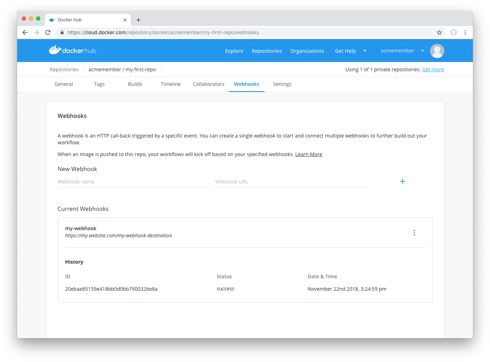

You can use webhooks to cause an action in another service in response to a push event in the repository. Webhooks are POST requests sent to a URL you define in Docker Hub.

Configure webhooks through the "Webhooks" tab on your Docker Hub repository:


### Creating Webhooks

To create a webhook, visit the webhooks tab for your repository. Then:
1. Provide a name for the webhooks
2. Provide a destination webhook URL. This is where webhook POST requests will be delivered:


### Viewing Webhook Delivery History

You can view Webhook Delivery History by clicking on the submenu of the webhook and then clicking "View History"


You can then view the delivery history, and whether delivering the POST request was successful or failed:



### Example Webhook Payload

Docker Hub Webhook payloads have the following payload JSON format:

```json
{
  "callback_url": "https://registry.hub.docker.com/u/svendowideit/testhook/hook/2141b5bi5i5b02bec211i4eeih0242eg11000a/",
  "push_data": {
    "images": [
        "27d47432a69bca5f2700e4dff7de0388ed65f9d3fb1ec645e2bc24c223dc1cc3",
        "51a9c7c1f8bb2fa19bcd09789a34e63f35abb80044bc10196e304f6634cc582c",
        "..."
    ],
    "pushed_at": 1.417566161e+09,
    "pusher": "trustedbuilder",
    "tag": "latest"
  },
  "repository": {
    "comment_count": 0,
    "date_created": 1.417494799e+09,
    "description": "",
    "dockerfile": "#\n# BUILD\u0009\u0009docker build -t svendowideit/apt-cacher .\n# RUN\u0009\u0009docker run -d -p 3142:3142 -name apt-cacher-run apt-cacher\n#\n# and then you can run containers with:\n# \u0009\u0009docker run -t -i -rm -e http_proxy http://192.168.1.2:3142/ debian bash\n#\nFROM\u0009\u0009ubuntu\n\n\nVOLUME\u0009\u0009[\/var/cache/apt-cacher-ng\]\nRUN\u0009\u0009apt-get update ; apt-get install -yq apt-cacher-ng\n\nEXPOSE \u0009\u00093142\nCMD\u0009\u0009chmod 777 /var/cache/apt-cacher-ng ; /etc/init.d/apt-cacher-ng start ; tail -f /var/log/apt-cacher-ng/*\n",
    "full_description": "Docker Hub based automated build from a GitHub repo",
    "is_official": false,
    "is_private": true,
    "is_trusted": true,
    "name": "testhook",
    "namespace": "svendowideit",
    "owner": "svendowideit",
    "repo_name": "svendowideit/testhook",
    "repo_url": "https://registry.hub.docker.com/u/svendowideit/testhook/",
    "star_count": 0,
    "status": "Active"
  }
}
```

### Validating a webhook callback

To validate a callback in a webhook chain, you need to

1. Retrieve the `callback_url` value in the request's JSON payload.
1. Send a POST request to this URL containing a valid JSON body.

> **Note**: A chain request is only considered complete once the last
> callback has been validated.


#### Callback JSON data

The following parameters are recognized in callback data:

* `state` (required): Accepted values are `success`, `failure`, and `error`.
  If the state isn't `success`, the Webhook chain is interrupted.
* `description`: A string containing miscellaneous information that is
  available on Docker Hub. Maximum 255 characters.
* `context`: A string containing the context of the operation. Can be retrieved
  from the Docker Hub. Maximum 100 characters.
* `target_url`: The URL where the results of the operation can be found. Can be
  retrieved on the Docker Hub.

*Example callback payload:*

    {
      "state": "success",
      "description": "387 tests PASSED",
      "context": "Continuous integration by Acme CI",
      "target_url": "http://ci.acme.com/results/afd339c1c3d27"
    }
