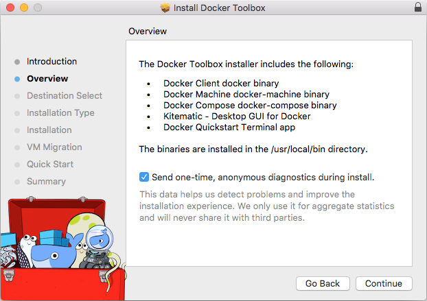
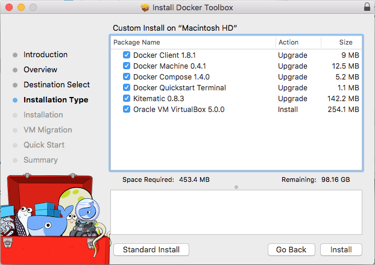
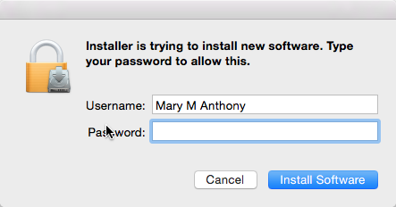
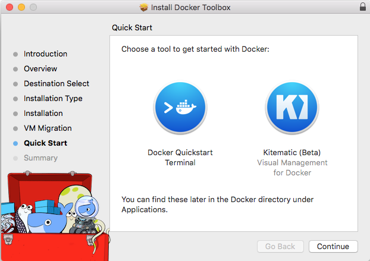
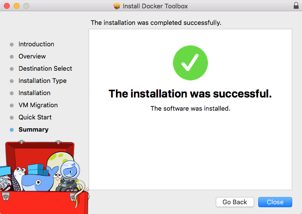

<!--[metadata]>
+++
title = "Install Toolbox on Mac"
description = "How to install Toolbox on Mac"
keywords = ["docker, documentation, install, toolbox, mac"]
[menu.main]
parent="workw_toolbox"
weight=-7
+++
<![end-metadata]-->

# Install Docker Toolbox on Mac OS X

Mac OS X users use Docker Toolbox to install Docker software. Docker Toolbox includes the following Docker tools:

* Docker CLI client for running Docker Engine to create images and containers
* Docker Machine so you can run Docker Engine commands from Mac OS X terminals
* Docker Compose for running the `docker-compose` command
* Kitematic, the Docker GUI
* the Docker QuickStart shell preconfigured for a Docker command-line environment
* Oracle VM VirtualBox

Because the Docker Engine daemon uses Linux-specific kernel features, you can't
run Docker Engine natively in OS X. Instead, you must use the Docker Machine
command,  `docker-machine`,  to create and attach to a small Linux VM on your
machine. This VM hosts Docker Engine for you on your Mac.

## Step 1: Check your version

Your Mac must be running OS X 10.8 "Mountain Lion" or newer to run Docker
software. To find out what version of the OS you have:

1. Choose **About this Mac** from the Apple menu.

    The version number appears directly below the words `OS X`.

2. If you have the correct version, go to the next step.

    If you aren't using a supported version, you could consider upgrading your
    operating system.

    If you have Mac OS X 10.10.3 Yosemite or newer, consider using [Docker for Mac](/docker-for-mac/index.md) instead. It runs natively on the Mac, so there is no need for a pre-configured Docker QuickStart shell. It uses xhyve for virtualization, instead of VirutalBox. Full install prerequisites are provided in the Docker for Mac topic in [Docker for Mac](/docker-for-mac/index.md#what-to-know-before-you-install).

## Step 2: Install Docker Toolbox

1. Install Docker Toolbox by double-clicking the package or by right-clicking
and choosing "Open" from the pop-up menu.

    The installer launches an introductory dialog, followed by an overview of what's installed.

    

2. Press **Continue** to install the toolbox.

    The installer presents you with options to customize the standard
    installation.

    

    By default, the standard Docker Toolbox installation:

    * installs binaries for the Docker tools in `/usr/local/bin`
    * makes these binaries available to all users
    * updates any existing Virtual Box installation

    For now, don't change any of the defaults.

3. Press **Install** to perform the standard installation.

     The system prompts you for your password.

     

4. Provide your password to continue with the installation.

     When it completes, the installer provides you with some shortcuts. You can ignore this for now and click **Continue**.

     

     Then click **Close** to finish the installer.

     

## Step 3: Verify your installation

To run a Docker container, you:

* create a new (or start an existing) Docker Engine host running
* switch your environment to your new VM
* use the `docker` client to create, load, and manage containers

Once you create a machine, you can reuse it as often as you like. Like any
Virtual Box VM, it maintains its configuration between uses.

1. Open the **Launchpad** and locate the Docker Quickstart Terminal icon.

    

2. Click the icon to launch a Docker Quickstart Terminal window.

    The terminal does a number of things to set up Docker Quickstart Terminal for you.

        Last login: Sat Jul 11 20:09:45 on ttys002
        bash '/Applications/Docker Quickstart Terminal.app/Contents/Resources/Scripts/start.sh'
        Get http:///var/run/docker.sock/v1.19/images/json?all=1&filters=%7B%22dangling%22%3A%5B%22true%22%5D%7D: dial unix /var/run/docker.sock: no such file or directory. Are you trying to connect to a TLS-enabled daemon without TLS?
        Get http:///var/run/docker.sock/v1.19/images/json?all=1: dial unix /var/run/docker.sock: no such file or directory. Are you trying to connect to a TLS-enabled daemon without TLS?
        -bash: lolcat: command not found

        mary at meepers in ~
        $ bash '/Applications/Docker Quickstart Terminal.app/Contents/Resources/Scripts/start.sh'
        Creating Machine dev...
        Creating VirtualBox VM...
        Creating SSH key...
        Starting VirtualBox VM...
        Starting VM...
        To see how to connect Docker to this machine, run: docker-machine env dev
        Starting machine dev...
        Setting environment variables for machine dev...

                                ##         .
                          ## ## ##        ==
                       ## ## ## ## ##    ===
                   /"""""""""""""""""\___/ ===
              ~~~ {~~ ~~~~ ~~~ ~~~~ ~~~ ~ /  ===- ~~~
                   \______ o           __/
                     \    \         __/
                      \____\_______/

        The Docker Quick Start Terminal is configured to use Docker with the “default” VM.

3.  Click your mouse in the terminal window to make it active.

    If you aren't familiar with a terminal window, here are some quick tips.

    

    The prompt is traditionally a `$` dollar sign. You type commands into the
    *command line* which is the area after the prompt. Your cursor is indicated
    by a highlighted area or a `|` that appears in the command line. After
    typing a command, always press RETURN.

4. Type the `docker run hello-world` command and press RETURN.

    The command does some work for you, if everything runs well, the command's
    output looks like this:

        $ docker run hello-world
        Unable to find image 'hello-world:latest' locally
        latest: Pulling from library/hello-world
        535020c3e8ad: Pull complete
        af340544ed62: Pull complete
        Digest: sha256:a68868bfe696c00866942e8f5ca39e3e31b79c1e50feaee4ce5e28df2f051d5c
        Status: Downloaded newer image for hello-world:latest

        Hello from Docker.
        This message shows that your installation appears to be working correctly.

        To generate this message, Docker took the following steps:
        1. The Docker Engine CLI client contacted the Docker Engine daemon.
        2. The Docker Engine daemon pulled the "hello-world" image from the Docker Hub.
        3. The Docker Engine daemon created a new container from that image which runs the
           executable that produces the output you are currently reading.
        4. The Docker Engine daemon streamed that output to the Docker Engine CLI client, which sent it
           to your terminal.

        To try something more ambitious, you can run an Ubuntu container with:
        $ docker run -it ubuntu bash

        Share images, automate workflows, and more with a free Docker Hub account:
        https://hub.docker.com

        For more examples and ideas, visit:
        https://docs.docker.com/userguide/
