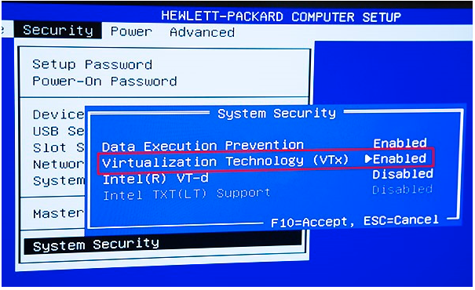

This page contains information about the system requirements and specific instructions that help you install Docker Desktop Enterprise (DDE) on Windows.

> **Warning:** If you are using the Community version of Docker Desktop, you must uninstall Docker Desktop Community in order to install Docker Desktop Enterprise.

# System requirements

- Windows 10 Pro or Enterprise version 15063 or later.

- Hyper-V and Containers Windows features must be enabled.

- The following hardware prerequisites are required to successfully run Client
Hyper-V on Windows 10:

  - 64 bit processor with [Second Level Address Translation (SLAT)](http://en.wikipedia.org/wiki/Second_Level_Address_Translation)

  - 4GB system RAM

  - BIOS-level hardware virtualization support must be enabled in the
    BIOS settings:

> **Note:** Docker supports Docker Desktop Enterprise on Windows based on Microsoft’s support lifecycle for Windows 10 operating system. For more information, see the [Windows lifecycle fact sheet](https://support.microsoft.com/en-us/help/13853/windows-lifecycle-fact-sheet).

# Installation

Download Docker Desktop Enterprise for [**Windows**](https://download.docker.com/win/enterprise/DockerDesktop.msi).

The Docker Desktop Enterprise installer includes Docker Engine, Docker CLI client, and Docker Compose.

Double-click the `.msi` file to begin the installation and follow the on-screen instructions. When the installation is complete, select **Docker Desktop** from the Start menu to start Docker Desktop.

For information about installing DDE using the command line, see [Command line installation](#command-line-installation).

# License file

Install the Docker Desktop Enterprise license file at the following location:

    %ProgramData%\DockerDesktop\docker_subscription.lic

You must create the path if it doesn't already exist. If the license file is missing, you will be asked to provide it when you try to run Docker Desktop Enterprise. Contact your system administrator to obtain the license file.

# Firewall exceptions

Docker Desktop Enterprise requires the following firewall exceptions. If you do not have firewall access, or are unsure about how to set firewall exceptions, contact your system administrator.

- The process `com.docker.vpnkit` proxies all outgoing container TCP and
    UDP traffic. This includes Docker image downloading but not DNS
    resolution, which is performed over a loopback TCP and UDP connection
    to the main application.

- The process `com.docker.vpnkit` binds external ports on behalf of
    containers. For example, `docker run -p 80:80 nginx` binds port 80 on all
    interfaces.

- If using Kubernetes, the API server is exposed with TLS on `127.0.0.1:6445` by `com.docker.vpnkit`.

# Version packs

Docker Desktop Enterprise is bundled with default version pack [Enterprise 3.0 (Docker Engine 19.03 / Kubernetes 1.14.1)](https://download.docker.com/win/enterprise/enterprise-3.0.ddvp). System administrators can install version packs using a command line tool to use a different version of the Docker Engine and Kubernetes for development work:

- [Docker Enterprise 2.0 (17.06/Kubernetes 1.8.11)](https://download.docker.com/win/enterprise/enterprise-2.0.ddvp)

- [Docker Enterprise 2.1 (18.09/Kubernetes 1.11.5)](https://download.docker.com/win/enterprise/enterprise-2.1.ddvp)

For information on using the CLI tool for version pack installation, see [Command line installation](#command-line-installation).

Available version packs are listed within the **Version Selection** option in the Docker Desktop menu. If more than one version pack is installed, you can select the corresponding entry to work with a different version pack. After you select a different version pack, Docker Desktop restarts and the selected Docker Engine and Kubernetes versions are used.

# Command line installation

>**Note:** Command line installation is supported for administrators only. You must have `administrator` access to run the CLI commands.

System administrators can use the command line for mass installation and fine tuning the Docker Desktop Enterprise deployment. Run the following command as an administrator to perform a silent installation:

    msiexec /i DockerDesktop.msi /quiet

You can also set the following properties:

- `INSTALLDIR [string]:` configures the folder to install Docker Desktop to (default is C:\Program Files\Docker\Docker)
- `STARTMENUSHORTCUT [yes|no]:` specifies whether to create an entry in the Start menu for Docker Desktop (default is yes)
- `DESKTOPSHORTCUT [yes|no]:` specifies whether to create a shortcut on the desktop for Docker Desktop (default is yes)

For example:

    msiexec /i DockerDesktop.msi /quiet AUTOSTART=no STARTMENUSHORTCUT=no INSTALLDIR=”D:\Docker Desktop”

Docker Desktop Enterprise includes a command line executable to install and uninstall version packs. When you install DDE, the command line tool is installed at the following location:

    [ApplicationPath]\dockerdesktop-admin.exe

## Version-pack install

Run the following command to install or upgrade a version pack to the version contained in the specified `.ddvp` archive:

    dockerdesktop-admin.exe -InstallVersionPack=[path-to-archive]

>**Note:** You must stop Docker Desktop before installing a version pack.

## Version-pack uninstall

Run the following command to uninstall the specified version pack:

    dockerdesktop-admin.exe -UninstallVersionPack=[version-pack-name|path-to-archive]

>**Note:** You must stop Docker Desktop before uninstalling a version pack.

## Application uninstall

To uninstall the application:

1. Open the **Add or remove programs** dialog

1. Select **Docker Desktop** from the **Apps & features** list.

1. Click **Uninstall**.
