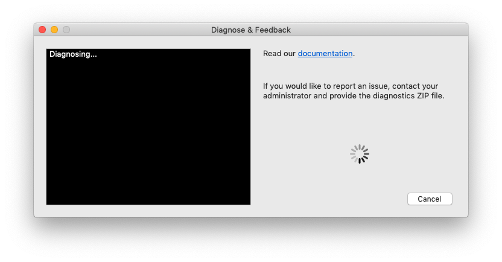
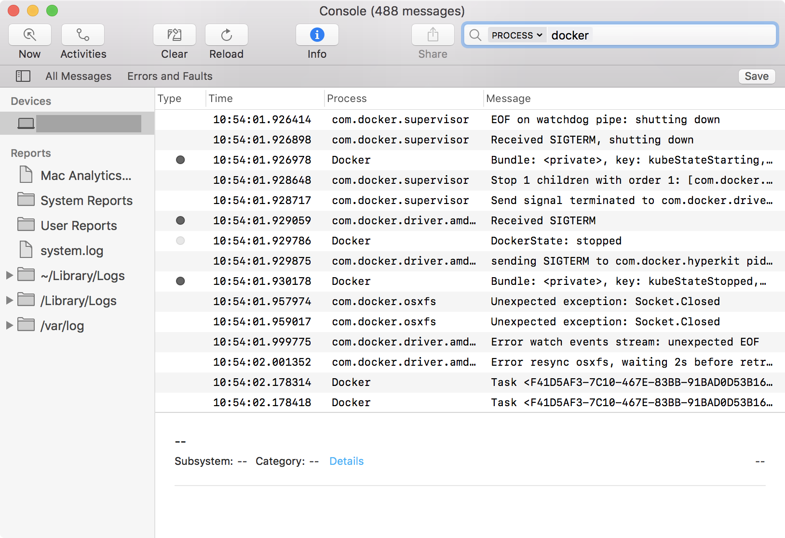

This page contains information on how to diagnose Docker Desktop Enterprise (DDE) issues on Mac.

## Creating a diagnostics file in Docker Desktop Enterprise

Select **Diagnose and Feedback** from the Docker menu in the menu bar.
=======
keywords: Troubleshoot, diagnose, mac, issues, Docker Enterprise, Windows, Mac, Docker Desktop, Enterprise
---

This topic contains information on how to diagnose Docker Desktop issues on Mac, send feedback, and submit the issues to Docker Support.

# Creating a diagnostics file in Docker Desktop Enterprise

Select **Diagnose and Feedback** from the whale menu in the menu bar.
>>>>>>> 1013: Move desktop ent content to docs-private



Once diagnostics are available, select the **Open** button to display the list of available diagnostics in Finder.

Diagnostics are provided in .zip files identified by date and time. The uncompressed contents are also visible in the Finder window. Send your diagnostics file to your administrator for assistance.

<<<<<<< HEAD
### Creating a diagnostics file from a terminal

In some cases, it is useful to run diagnostics yourself, for instance if Docker Desktop Enterprise cannot start.

To run diagnostics from a terminal, enter the following command:

```
/Applications/Docker.app/Contents/MacOS/com.docker.diagnose gather
```

This command displays the information that it is gathering, and when it finishes, it displays information resembling the following example:

=======
## Creating a diagnostics file from a terminal

On occasion, it is useful to run diagnostics yourself, for instance if Docker Desktop Enterprise cannot start.

To run diagnostics from a terminal, enter the following command :
```
/Applications/Docker.app/Contents/MacOS/com.docker.diagnose gather
```
This command displays the information that it is gathering, and when it finishes, it displays information resembling the following example:
>>>>>>> 1013: Move desktop ent content to docs-private
```
Diagnostics Bundle: /tmp/2A989798-1658-4BF0-934D-AC4F148D0782/20190115142942.zip
Diagnostics ID:     2A989798-1658-4BF0-934D-AC4F148D0782/20190115142942
```
<<<<<<< HEAD

=======
>>>>>>> 1013: Move desktop ent content to docs-private
The name of the diagnostics file is displayed next to “Diagnostics Bundle” (`/tmp/2A989798-1658-4BF0-934D-AC4F148D0782/20190115142942.zip` in this example). This is the file that you attach to the support ticket.

You can view the content of your diagnostics file using the **open** command and specifying the name of your diagnostics file:

```sh
$ open /tmp/2A989798-1658-4BF0-934D-AC4F148D0782/20190115142942.zip
```

<<<<<<< HEAD
### Viewing logs in a terminal
=======
## Viewing logs in a terminal
>>>>>>> 1013: Move desktop ent content to docs-private

In addition to using the **Diagnose and Feedback** option to generate a diagnostics file, you can
browse Docker Desktop Enterprise logs in a terminal or with the Console app.

To watch the live flow of Docker Desktop Enterprise logs at the command line, run the following command from
your favorite shell:

```bash
$ pred='process matches ".*(ocker|vpnkit).*"
  || (process in {"taskgated-helper", "launchservicesd", "kernel"} && eventMessage contains[c] "docker")'
$ /usr/bin/log stream --style syslog --level=debug --color=always --predicate "$pred"
```

Alternatively, to collect the last day of logs (`1d`) in a file, run:

```
$ /usr/bin/log show --debug --info --style syslog --last 1d --predicate "$pred" >/tmp/logs.txt
```

<<<<<<< HEAD
### Viewing logs with the Console app

The Console log viewer is located in `/Applications/Utilities`; you can search for it with Spotlight Search.
=======
## Viewing logs with the Console app

The Console log viewer is located in `/Applications/Utilities`; you can search for it with
Spotlight Search.
>>>>>>> 1013: Move desktop ent content to docs-private

In the Console window search bar, type
`docker` and press Enter. Then select **ANY** to expand the drop-down list next to your 'docker' search entry, and select **Process**.



You can use the Console app to search logs, filter the results in various
ways, and create reports.

<<<<<<< HEAD
### Additional Docker Desktop Enterprise troubleshooting topics
=======
## Additional Docker Desktop Enterprise troubleshooting topics
>>>>>>> 1013: Move desktop ent content to docs-private

You can also find additional information about various troubleshooting topics in the [Docker Desktop for Mac community](https://docs.docker.com/docker-for-mac/troubleshoot/) documentation.
