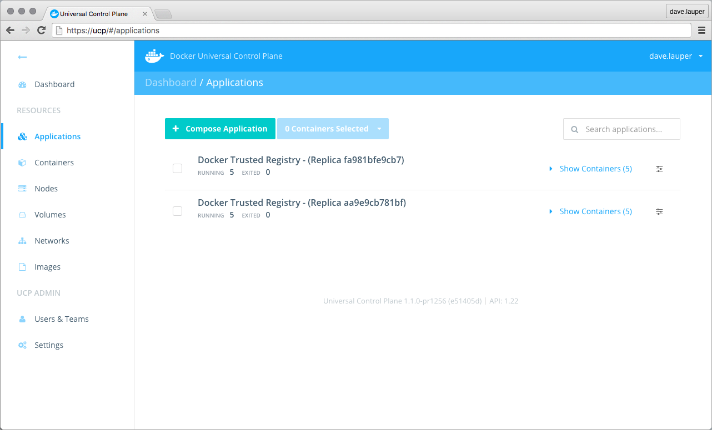

<!--[metadata]>
+++
aliases = [ "/docker-trusted-registry/install/dtr-ami-byol-launch/",
            "/docker-trusted-registry/install/dtr-ami-bds-launch/",
            "/docker-trusted-registry/install/dtr-vhd-azure/"]
title = "Install Docker Trusted Registry"
description = "Learn how to install Docker Trusted Registry for production."
keywords = ["docker, dtr, registry, install"]
[menu.main]
parent="workw_dtr_install"
weight=20
+++
<![end-metadata]-->


# Install Docker Trusted Registry

Docker Trusted Registry (DTR) is a containerized application that can be
installed on-premises or on a cloud infrastructure.

The first step in installing DTR, is ensuring your
infrastructure has all the [requirements DTR needs to run](system-requirements).
Once that is done, use these instructions to install DTR.


## Step 1. Install DTR

To install DTR you use the `docker/dtr` image. This image has commands to
install, configure, and backup DTR.

To find what commands and options are available, check the
[reference documentation](../reference/install.md), or run:

```bash
$ docker run --rm -it docker/dtr --help
```

To install DTR:

1. Run the following command on any Docker daemon to install DTR:

    ```bash
    $ docker run -it --rm \
      docker/dtr install
    ```

    In this example we're running the install command interactively, so that it
    prompts for the necessary configuration values.
    You can also use flags to pass values to the install command.

2. Check that DTR is running.

    In your browser, navigate to the the Docker **Universal Control Plane**
    web UI, and navigate to the **Applications** screen. DTR should be listed
    as an application.

    

    You can also access the **DTR web UI**, to make sure it is working. In your
    browser, navigate to the address were you installed DTR.

    


## Step 2. Configure DTR

After installing DTR, you should configure:

  * The Domain Name used to access DTR,
  * The certificates used for TLS communication,
  * The storage backend to store the Docker images.

  To perform these configurations, navigate to the **Settings** page of DTR.

  

## Step 3. Test pushing and pulling

Now that you have a working installation of DTR, you should test that you can
push and pull images to it.
[Learn how to push and pull images](../repos-and-images/push-and-pull-images.md).

## Step 4. Join replicas to the cluster

To set up DTR for [high availability](../high-availability/high-availability.md),
you can add more replicas to your DTR cluster. Adding more replicas allows you
to load-balance requests across all replicas, and keep DTR working if a
replica fails.

To add replicas to a DTR cluster, use the `docker/dtr join` command. To find
what options are available, check the
[reference documentation](../reference/join.md), or run:

```bash
$ docker run --rm -it docker/dtr join --help
```

To add replicas:

1. Make your Docker CLI client point to UCP.

2. Run the join command:

    ```bash
    $ docker run -it --rm \
      docker/dtr join
    ```

    In this example we'll be running the join command interactively, so that it
    prompts for the necessary configuration values.
    You can also use flags to pass values to the command.

3. Check that all replicas are running.

    In your browser, navigate to the the Docker **Universal Control Plane**
    web UI, and navigate to the **Applications** screen. All replicas should
    be displayed.

    

4. Follow steps 1 to 3, to add more replicas to the DTR cluster.

    When configuring your DTR cluster for high-availability, you should install
    3, 5, or 7 replicas.
    [Learn more about high availability](../high-availability/high-availability.md)

## See also

* [Install DTR offline](install-dtr-offline.md)
* [Upgrade DTR](upgrade/upgrade-major.md)
