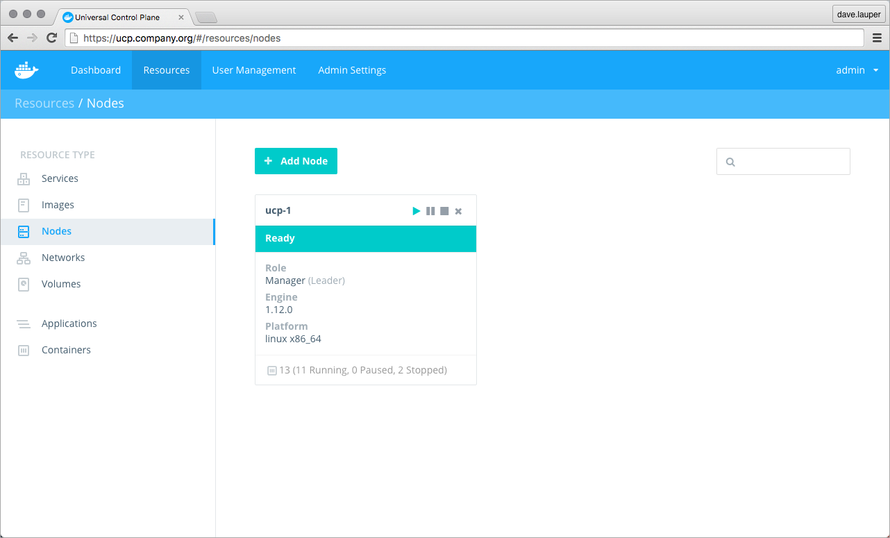
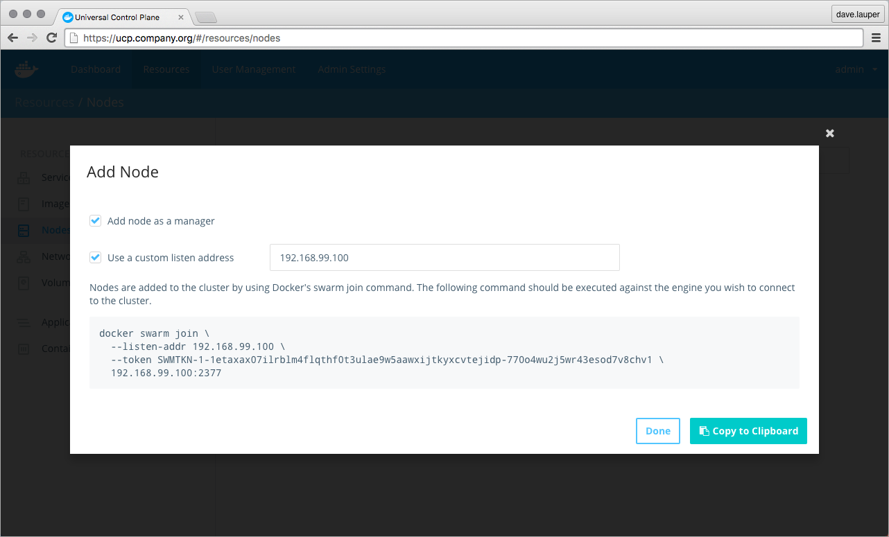
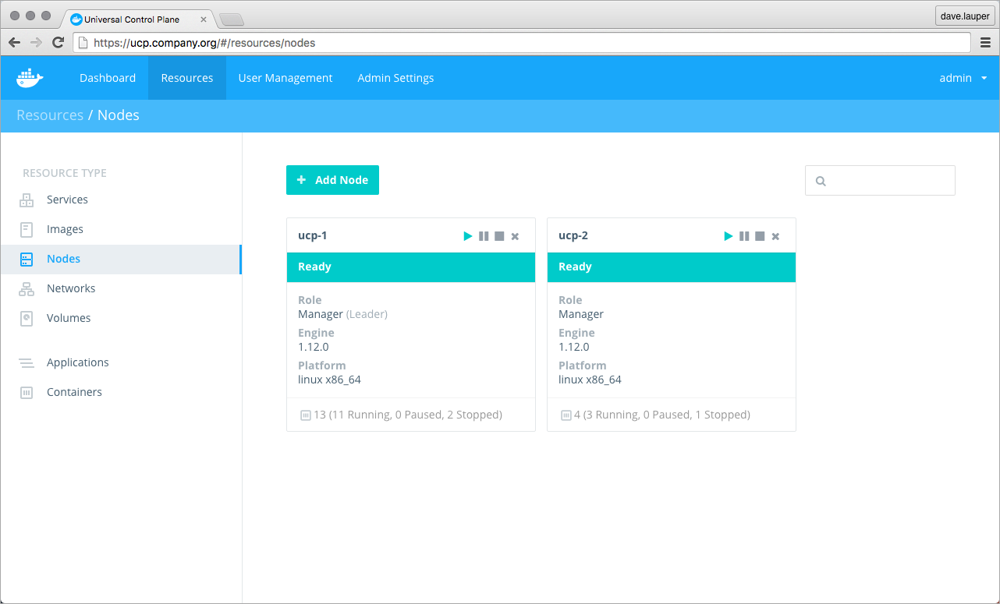

<!--[metadata]>
+++
aliases = [ "/ucp/production-install/"]
title = "Install UCP for production"
description = "Learn how to install Docker Universal Control Plane on production"
keywords = ["Universal Control Plane, UCP, install"]
[menu.main]
parent="mn_ucp_installation"
identifier="ucp_install_production"
weight=20
+++
<![end-metadata]-->

# Install UCP for production

Docker Universal Control Plane (UCP) is a containerized application that can be
installed on-premise or on a cloud infrastructure.

If you're installing Docker Datacenter on Azure, [follow this guide](https://success.docker.com/?cid=ddc-on-azure).

## Step 1: Validate the system requirements

The first step to installing UCP, is ensuring your
infrastructure has all the [requirements UCP needs to run](system-requirements.md).


## Step 2: Install CS Docker on all nodes

UCP is a containerized application that requires CS Docker Engine 1.12.0 or
above to run. Start by [installing CS Docker Engine](/cs-engine/install.md)
on all hosts that you want to manage with UCP.

Make sure you install the same CS Docker Engine version on all the nodes. Also,
if you're creating virtual machine templates with CS Docker Engine  already
installed, make sure the `/etc/docker/key.json` file is not included in the
virtual machine image. When provisioning the virtual machine, restart the Docker
daemon to generate a new `/etc/docker/key.json` file.

## Step 3: Customize named volumes

Skip this step if you want to use the defaults provided by UCP.

Docker UCP uses named volumes to persist data. If you want
to customize the drivers used to manage these volumes, you can create the
volumes before installing UCP. When you install UCP, the installer
will notice that the volumes already exist, and will start using them.
[Learn about the named volumes used by UCP](../architecture.md).

If these volumes don't exist, they'll be automatically created when installing
UCP.

## Step 4: Install UCP

To install UCP you use the `docker/ucp` image, which has commands to install and
manage UCP.

To install UCP:

1. Use ssh to log in into the host where you want to install UCP.

2. Run the following command:

    ```bash
    $ docker run --rm -it --name ucp \
      -v /var/run/docker.sock:/var/run/docker.sock \
      docker/ucp:2.0.0-beta1 install \
      --host-address <node-ip-address> \
      --interactive
    ```

    This runs the install command in interactive mode, so that you're
    prompted for any necessary configuration values.
    To find what other options are available in the install command, check the
    [reference documentation](../reference/install.md).

## Step 5: License your installation

Now that UCP is installed, you need to license it. In your browser, navigate
to the UCP web UI and upload your license.


If you don't have a license yet, [learn how to get a free trial license](license.md).

## Step 6: Join manager nodes

Skip this step if you don't want your UCP swarm to be highly available.

To make your UCP swarm fault-tolerant and highly available, you
can join more manager nodes to your it. Manager nodes are the nodes in the
swarm that perform the orchestration and swarm management tasks, and
dispatch tasks for worker nodes to execute.
[Learn more about high-availability](../high-availability/set-up-high-availability.md).

To join manager nodes to the swarm, go to the **UCP web UI**, navigate to
the **Resources** page, and go to the **Nodes** section.



Click the **Add Node button** to add a new node.



Check the 'Add node as a manager' to turn this node into a manager and replicate
UCP for high-availability.
Set the 'Use a custom listen address' option if you want to customize the
network and port where this node will listen for swarm management traffic. By
default the node listens on port 2377.
Set the 'Use a custom advertise address' option if you want to customize the
network and port this node will advertise to other swarm members so that they
can reach it.

For each manager node that you want to join to UCP, login into that
node using ssh, and run the join command that is displayed on UCP.



After you run the join command in the node, the node starts being displayed
in UCP.

## Step 7: Join worker nodes

Skip this step if you don't want to add more nodes to run and scale your apps.

To add more computational resources to your swarm, you can join worker nodes.
These nodes execute tasks assigned to them by the manager nodes. For this,
use the same steps as before, but don't check the 'Add node as a manager'
option.

## Where to go next

* [Use externally-signed certificates](../configuration/use-externally-signed-certs.md)
* [Integrate with LDAP](../configuration/ldap-integration.md)
