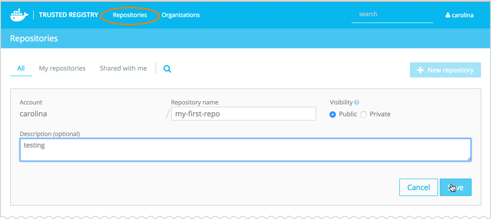

+++
title = "User guide"
description = "Documentation describing basic use of Docker Trusted Registry"
keywords = ["docker, documentation, about, technology, hub, push, pull, user interface, account management, enterprise"]
[menu.main]
parent="workw_dtr"
weight=3
+++

# Docker Trusted Registry User's Guide

This guide explains tasks and functions that a Docker Trusted Registry
user can do, such as pushing or pulling images, or viewing organizations. For tasks Docker Trusted Registry
administrators need to accomplish, such as configuring or monitoring Docker Trusted Registry,
go to the [Administrator's Guide](adminguide.md).

Task you can do:

* View organizations, repositories, and team members through the Trusted Registry user interface.
* Create repositories if you have read-write permissions.
* Tag an image so that it can later be removed from the Trusted Registry repository. See the [documentation](soft-garbage.md) for deleting an image.
* Push tags
* Pull tags
* Search the API documentation on the Trusted Registry user interface including using the reindex and search APIs.

## View repos, teams, and members in the user interface

Depending on your permissions, you can use the Trusted Registry user interface to do the following:

* View the organizations and teams that you belong to.
* View the repositories within each organization that you belong to.

For specifics on this feature, see the [account management](accounts.md) documentation.

## Create a repository

If you have read-write permissions, you can create a repository. You will need to create one if you have installed the Trusted Registry and you want to test your installation by pushing an image to a repository.

1. In the Trusted Registry UI, navigate to Repositories and click New repository.

2. Enter a name, select visibility, and click Save.

## Push and pull overview

One of your main activities you do in the Trusted Registry, is to push and pull
images to and from the Trusted Registry image storage service. For example, you
might pull an official image for Ubuntu from the Docker Hub, customize it with
configuration settings for your infrastructure, and then push it to your Docker
Trusted Registry image storage for other developers to pull and use for their
development environments.

Pushing and pulling images with Trusted Registry works similarly like any other
Docker registry. You use the `docker pull` command to retrieve images and the
`docker push` command to add an image. To learn more about Docker images, see
[User Guide: Working with Docker Images](https://docs.docker.com/engine/userguide/dockerimages/). For a step-by-step
example of the entire process, see the
[Quick Start: Basic Workflow Guide](quick-start.md).

> **Note**: If your Docker Trusted Registry instance has authentication enabled, you will need to
>use your command line to `docker login <dtr-hostname>` (for example `docker login
> dtr.yourdomain.com`).
>
> Failures due to unauthenticated `docker push` and `docker pull` commands
> look like:
>
>     $ docker pull dtr.yourdomain.com/hello-world
>     Pulling repository dtr.yourdomain.com/hello-world
>     FATA[0001] Error: image hello-world:latest not found
>
>     $ docker push dtr.yourdomain.com/hello-world
>     The push refers to a repository [dtr.yourdomain.com/hello-world] (len: 1)
>     e45a5af57b00: Image push failed
>     FATA[0001] Error pushing to registry: token auth attempt for registry
>     https://dtr.yourdomain.com/v2/:
>     https://dtr.yourdomain.com/auth/v2/token/?scope=
>     repository%3Ahello-world%3Apull%2Cpush&service=dtr.yourdomain.com
>     request failed with status: 401 Unauthorized

## Push images

You push an image up to a Docker Trusted Registry repository by using the
[`docker push` command](https://docs.docker.com/reference/commandline/push).

You can add a `tag` to your image so that you can more easily identify it
among other variants and so that it refers to your Docker Trusted Registry server.

    $ docker tag hello-world:latest dtr.yourdomain.com/yourusername/hello-mine:latest

The command labels a `hello-world:latest` image using a new tag in the
`[REGISTRYHOST/][USERNAME/]NAME[:TAG]` format.  The `REGISTRYHOST` in this
case is your Docker Trusted Registry server, `dtr.yourdomain.com`, and the `USERNAME` is
`yourusername`. Lastly, the image tag is set to `hello-mine:latest`.

Once an image is tagged, you can push it to Docker Trusted Registry with:

    $ docker push dtr.yourdomain.com/yourusername/hello-mine:latest

> **Note**: If the Docker daemon on which you are running `docker push` doesn't
> have the right certificates set up, you get an error similar to:
>
>     $ docker push dtr.yourdomain.com/demouser/hello-world
>     FATA[0000] Error response from daemon: v1 ping attempt failed with error:
>     Get https://dtr.yourdomain.com/v1/_ping: x509: certificate signed by
>     unknown authority. If this private registry supports only HTTP or HTTPS
>     with an unknown CA certificate, please add `--insecure-registry
>     dtr.yourdomain.com` to the daemon's arguments. In the case of HTTPS, if
>     you have access to the registry's CA certificate, no need for the flag;
>     simply place the CA certificate at
>     /etc/docker/certs.d/dtr.yourdomain.com/ca.crt

## Pull images

You can retrieve an image with the
[`docker pull` command](https://docs.docker.com/reference/commandline/run),
or you can retrieve an image and run Docker to build the container with the
[`docker run`command](https://docs.docker.com/reference/commandline/run).

To retrieve an image from the Trusted Registry and then run Docker to build the
container, add
the needed info to `docker run`:

        $ docker run dtr.yourdomain.com/yourusername/hello-mine
        latest: Pulling from dtr.yourdomain.com/yourusername/hello-mine
        511136ea3c5a: Pull complete
        31cbccb51277: Pull complete
        e45a5af57b00: Already exists
        Digest: sha256:45f0de377f861694517a1440c74aa32eecc3295ea803261d62f950b1b757bed1
        Status: Downloaded newer image for dtr.yourdomain.com/demouser/hello-mine:latest

If you don't specify a version, by default the `latest` version of an
image is pulled.

If you run `docker images` after this, then you see a `hello-mine` image.

        $ docker images
        REPOSITORY                           TAG     IMAGE ID      CREATED       VIRTUAL SIZE
        dtr.yourdomain.com/yourusername/hello-mine  latest  e45a5af57b00  3 months ago  910 B

To pull an image without building the container, use `docker pull` and specify
your Docker Trusted Registry by adding it to the command:

     $ docker pull dtr.yourdomain.com/yourusername/hello-mine

## Next steps

For information on administering the Trusted Registry, see the
[administrator's tasks ](adminguide.md) documentation.

<!--TODO:

* mention that image aliases that are not in the same repository are not updated - either on push or pull
* but that multiple tags in one repo are pushed if you don't specify the `:tag` (ie, `imagename` does not always mean `imagename:latest`)
* show what happens for non-latest, and when there are more than one tag in a repo
* explain the fully-qualified repo/image name
 -->
